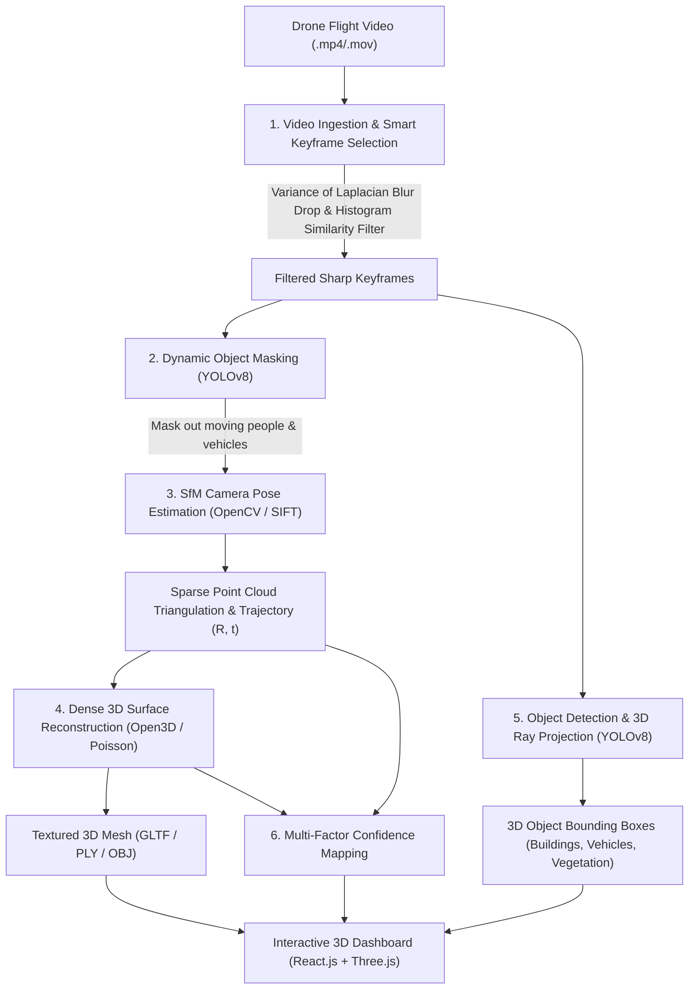

# AEROVISTA-X — Prototype System
**SIH26158: Single-Pass Drone Video to Accurate 3D Model Generation System**
*Team: The Sixth Syndicate | Theme: Robotics and Drones*

---

## 🛸 Core Value Proposition
> **"One Flight → One Video → 3D Digital Twin"**  
> Eliminates repeated drone passes and reduces heavy dependence on Ground Control Points (GCPs) by combining single-pass visual Structure-from-Motion (SfM), YOLOv8 dynamic masking/semantic segmentation, rule-based confidence mapping, and an interactive web dashboard.

---

## 📐 System Pipeline Architecture



---

## 🛠️ Quickstart Setup Instructions

### Option 1: Direct Local Execution (Fastest Demo Setup)

#### 1. Start Backend (Python FastAPI)
```bash
cd backend
python -m venv venv
# On Windows:
.\venv\Scripts\activate
# On Linux/macOS:
source venv/bin/activate

pip install -r requirements.txt
uvicorn app.main:app --reload --port 8000
```
*The backend automatically generates a sample drone video (`sample_drone_flight.mp4`) on initial startup.*

#### 2. Start Frontend (React + Three.js)
```bash
cd frontend
npm install
npm run dev
```
Open [http://localhost:3000](http://localhost:3000) or [http://localhost:5173](http://localhost:5173) in your browser.

---

### Option 2: Docker Compose (Full Stack with PostGIS)
```bash
docker-compose up --build
```
- Frontend: `http://localhost:3000`
- Backend REST API: `http://localhost:8000/docs`
- PostGIS Database: `localhost:5432`

---

## 🔍 Real AI/CV vs. Simplified Hackathon Heuristics

| Feature / Stage | Implementation in this Prototype | Production Target Pipeline |
|---|---|---|
| **Blur Detection** | Variance-of-Laplacian thresholding ($V = \mathrm{Var}(\text{Laplacian}(I)) < 80.0$) | Pretrained ResNet/MobileNet blur classifier |
| **Duplicate Frame Drop** | Color histogram correlation & SSIM metric ($S > 0.85$) | SIFT feature descriptor overlap matching |
| **Camera Pose Estimation** | OpenCV SIFT/ORB feature extraction & essential matrix pose recovery ($E = [t]_\times R$) | Full bundle-adjusted COLMAP / Visual SLAM pipeline |
| **3D Mesh Generation** | Open3D Poisson Surface Reconstruction & Trimesh GLTF exporter | OpenMVS multi-view dense stereo mesh texturing |
| **Object Detection** | Pretrained YOLOv8 for 2D detection + 3D bounding box ray projection | Trained 3D point cloud segmentation (PointGroup / VoteNet) |
| **Confidence Mapping** | Rule-based heuristic: $C = 0.45 \cdot \text{Density} + 0.35 \cdot (1 - \text{ReprojErr}) + 0.20 \cdot \text{ObservedFlag}$ | Trained uncertainty network / Bayesian deep learning |
| **Geo-Referencing** | Camera EXIF GPS metadata origin transformation ($WGS84 \to \text{Local 3D}$) | Multi-sensor EKF (GPS + IMU + RTK Ground Control Points) |

---

## 📊 Features & Dashboard Capabilities

1. **Interactive 3D Digital Twin Viewer**: Smooth orbit, pan, zoom controls over textured 3D mesh models with lighting and grid references.
2. **Camera Path Visualization**: Renders 3D camera frustums and keyframe capture positions along the drone trajectory.
3. **Confidence Heatmap Overlay**: Instant visual feedback on mesh quality (Green = High Confidence $>70\%$, Yellow = Medium, Red = Low $<40\%$).
4. **3D Object Bounding Boxes & Legend**: Clickable 3D wireframe boxes around detected structures with category labels, confidence percentages, and estimated volume ($m^3$).
5. **Interactive 3D Measurement Tools**:
   - **Distance Tool**: Click 2 points in 3D space to measure Euclidean distance ($m$).
   - **Height Tool**: Click structure base and top to measure vertical elevation ($\Delta Z$).
   - **Planar Area Tool**: Click 3+ points to calculate surface area ($m^2$).
6. **GIS Geo-Referencing Card**: Lat/Long coordinates, WGS84 origin, spatial scale ratio ($1\text{ unit} = 1.0\text{ m}$), and confidence breakdown.

---

## ⚠️ Known Limitations
- **Hardware Acceleration**: CPU-fallback mode is enabled by default for hackathon compatibility; processing long 4K videos on CPU takes 2–3 minutes vs seconds on CUDA GPUs.
- **Occluded Roof Surfaces**: Single-pass flights without oblique angles may result in lower confidence scores under overhanging ledges (explicitly highlighted by the Confidence Heatmap).
- **Measurement Scale**: Scale is derived from altitude/sensor intrinsics; sub-centimeter survey accuracy still requires 1–2 GCP references in production.
